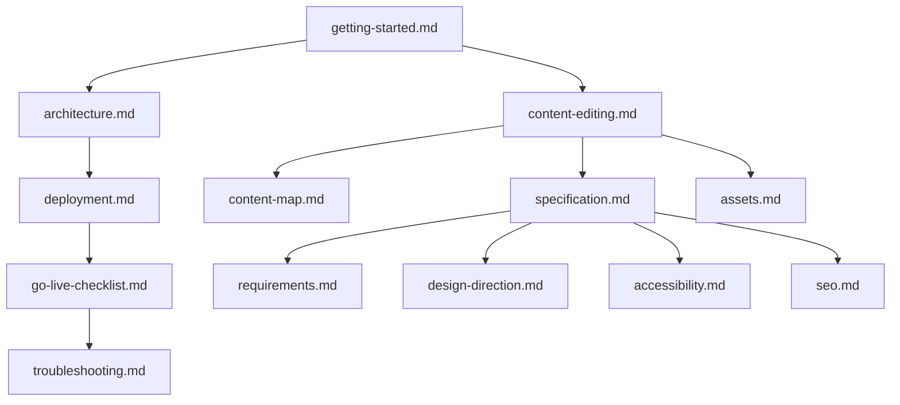

# Documentation Index

Complete reference for the **Balaji Selvaraj** portfolio site — an Astro 4 static site
deployed to GitHub Pages at https://balajiselvaraj1601.github.io.

## Start here

| Doc | Audience | Purpose |
|-----|----------|---------|
| [Getting started](./getting-started.md) | Developers | Install, run, build, preview |
| [Go-live checklist](./go-live-checklist.md) | Owner / DevOps | Publish to GitHub Pages step-by-step |
| [Content editing](./content-editing.md) | Content owner | Change site copy via `content/*.json` |
| [Assets](./assets.md) | Content owner | Résumé PDF, OG image, favicons, images |

## Architecture & specs

| Doc | Purpose |
|-----|---------|
| [Architecture](./architecture.md) | Repo layout, data flow, build pipeline, key files |
| [Requirements](./requirements.md) | MoSCoW feature list and acceptance criteria |
| [Specification](./specification.md) | IA, routes, component hierarchy, section contracts |
| [Content map](./content-map.md) | Résumé → portfolio traceability |
| [Design direction](./design-direction.md) | Visual tokens, typography, motion principles |

## Quality & platform

| Doc | Purpose |
|-----|---------|
| [SEO](./seo.md) | Meta tags, OG/Twitter, JSON-LD, sitemap, robots |
| [Accessibility](./accessibility.md) | WCAG 2.1 AA checklist |
| [Deployment](./deployment.md) | GitHub Pages target, CI/CD, artifact checklist |
| [Troubleshooting](./troubleshooting.md) | Common build, deploy, and content errors |

## Related files outside `docs/`

| File | Purpose |
|------|---------|
| [../README.md](../README.md) | Project overview and quick commands |
| [../AGENTS.md](../AGENTS.md) | Agent/AI coding guidelines |
| [../content/README.md](../content/README.md) | Content layer provenance and curation rules |

## Documentation map



## Quick commands

```bash
npm ci              # install pinned dependencies
npm run dev         # local dev server (HMR)
npm run build       # production build → dist/
npm run preview     # serve dist/ locally
```
