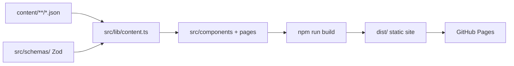
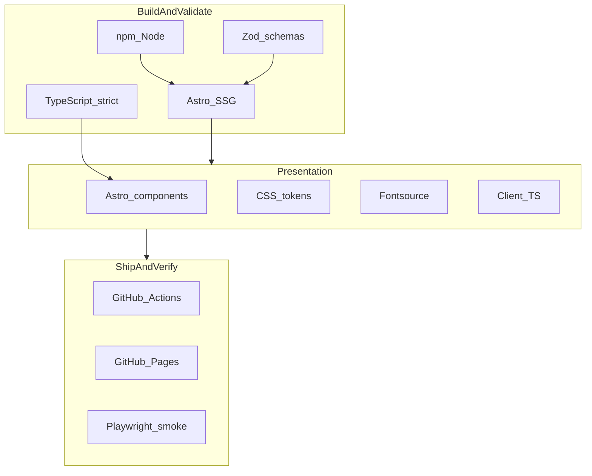

# Programming Languages and Programmatic Skills

Reference map of languages used in this repo (and adjacent workspace tooling), plus the skill set needed to build, automate, and operate this environment programmatically.

## Scope

This covers **two layers**:

1. **`portfolio_site/`** — this repo (Astro portfolio + Cursor task-runner).
2. **Adjacent workspace** — sibling repos under `/home/engineer/workspace/` that feed or surround it (resume pipeline, agent orchestration, image tooling).

---

## Languages in `portfolio_site`

| Language / format             | Where it lives                                                             | Role                                                                      |
| ----------------------------- | -------------------------------------------------------------------------- | ------------------------------------------------------------------------- |
| **Astro** (`.astro`)          | `src/components/`, `src/pages/`, `src/layouts/`                            | Primary UI layer — ~69 files; HTML-like templates with TS frontmatter     |
| **TypeScript** (`.ts`)        | `src/schemas/`, `src/lib/content.ts`, `src/scripts/*.ts`                   | Schema contracts, content loading, client-side nav/theme/save-page        |
| **JavaScript (ESM)** (`.mjs`) | `astro.config.mjs`, `scripts/*.mjs`, `.cursor/scripts/smoke-localhost.mjs` | Build config, icon tooling, Playwright smoke tests                        |
| **CSS**                       | `src/styles/global.css`                                                    | Hand-rolled design tokens and layout (no Tailwind/framework)              |
| **JSON**                      | `content/**/*.json`, `content/site.json`                                   | **Single source of truth for all public copy** and route/section wiring   |
| **Bash**                      | `.cursor/hooks/*.sh`, `.cursor/scripts/task-runner-*.sh`                   | Task-runner automation, Cursor hook glue                                  |
| **Python**                    | `scripts/icons/process_logos.py`                                           | Logo normalization/trim pipeline (Pillow + Playwright)                    |
| **YAML**                      | `.github/workflows/deploy.yml`                                             | CI build + GitHub Pages deploy                                            |
| **Markdown**                  | `docs/`, `TASKS.md` (per-batch), `.cursor/skills/`                         | Specs, agent instructions, checkbox task queue (operational, not runtime) |

**Not a separate language but essential:** **HTML** (inside Astro), **SVG** (icons/logos in `public/assets/`), **Git** (branch/CI workflow).

### Data flow (what most programmatic edits touch)

---

## Tech stack skills

The tier sections below describe **how much** of each skill domain you need day to day. This section maps **each pinned technology** to the concrete competencies it expects.

### Stack layers

### Runtime and build

**Node.js + npm** (≥18 locally; CI uses 20)

- Use `npm ci` (not `npm install`) to respect `package-lock.json` pins.
- ESM modules throughout (`"type": "module"` in `package.json`).
- Run `npm run build` as the primary validation gate after code or content changes.

**Astro 4.16** (static SSG)

- Component frontmatter: props, imports, scoped `<style>` blocks.
- Static data loading at build time (`import` from `@lib/content`, not runtime fetches).
- Minimal hydration — prefer server-rendered HTML plus small client scripts in `src/scripts/`.
- Section wiring via `SectionRenderer.astro` + `content/site.json` (`home.sections`, `viewSections`).

**TypeScript 5.9** (extends `astro/tsconfigs/strict`)

- Path aliases: `@lib/*`, `@content/*`, `@components/*`, `@layouts/*`, `@schemas`.
- JSON module resolution (`resolveJsonModule: true`).
- Types derived from Zod via `z.infer` — no parallel hand-written interfaces.

**Zod 3**

- Schema-first field changes (`z.object`, `z.enum`, `z.infer`).
- Interpreting build-time `safeParse` errors with field paths in `src/lib/content.ts`.
- Extend `src/schemas/` before editing matching JSON under `content/`.

**@astrojs/check** (optional dev check)

- Run `npm run check` for Astro + TypeScript diagnostics beyond the build.

### Presentation

**Hand-rolled CSS** (`src/styles/global.css`)

- Custom properties: `--space-*`, `--font-*`, `--radius-*`, theme colors.
- Theme switching via `[data-theme]` on `<html>` (see `ThemeScript.astro`).
- Responsive layout with `clamp()`; respect `prefers-reduced-motion` for animations.
- Component-scoped styles in `.astro` files when layout is section-specific.

**@fontsource** (self-hosted fonts)

- Inter Variable (body/UI), DM Serif Display (headings/editorial), JetBrains Mono (metadata/eyebrows).
- Import fonts in `global.css`; assign roles via `--font-sans`, `--font-display`, `--font-mono` tokens.
- See [Typography](./typography.md) and [Design direction](./design-direction.md) for role mapping.

**Vanilla TypeScript client scripts** (`src/scripts/`)

- Hash-based nav + scroll-spy in `section-views.ts` (all sections always visible).
- Theme toggle, mobile nav, reveal animations in `site-chrome.ts`.
- Progressive enhancement — core content readable without JavaScript; hash anchors still work natively.
- Accessibility: `aria-current` on nav links, focus trap in mobile menu, reduced-motion fallbacks.

**Icons** (`src/lib/icons.ts`, `Icon.astro`)

- Semantic icon keys validated by Zod enum; SVG paths in `src/lib/icon-paths.json`.
- Add new icons to the enum and path map before referencing in content JSON.

### SEO, sitemap, and metadata

**Canonical URLs and OG tags** (`BaseHead.astro`, `content/site.json` → `seo`)

- Single source of truth: `SITE_URL` in `astro.config.mjs`; keep `public/robots.txt` in sync.
- JSON-LD `Person` schema derived from `content/person/profile.json`.
- Open Graph and Twitter card meta; absolute OG image URLs from `Astro.site`.

**@astrojs/sitemap 3.6.0** (pinned — do not upgrade on Astro 4)

- Versions ≥3.6.1 require Astro 5 and crash the Astro 4 build.
- Keep `REDIRECT_STUB_PATHS` in `astro.config.mjs` aligned with redirect stub pages under `src/pages/`.

### Quality, lint, and deploy

**ESLint 10 + Prettier** (devDependencies; run via npm scripts)

- `npm run lint` / `npm run lint:fix` — Astro-aware ESLint (`eslint-plugin-astro`).
- `npm run format` / `npm run format:check` — Prettier with `prettier-plugin-astro`.
- Config files may land separately; follow existing repo conventions when editing.

**Playwright** (`.cursor/scripts/smoke-localhost.mjs`)

- Headless Chromium smoke against a running dev server (`npm run dev` first).
- Checks hero visibility, layout regressions, filter isolation, hash nav.
- Run via `npm run smoke:localhost`.

**GitHub Actions + GitHub Pages** (`.github/workflows/deploy.yml`)

- Pipeline: `npm ci` → `npm run build` → upload `dist/` artifact → `deploy-pages`.
- Deploy job runs only when `github.repository == 'balajiselvaraj1601/balajiselvaraj1601.github.io'`.
- Staging mirror validates builds without publishing.

**Python + Pillow** (optional — `scripts/icons/process_logos.py`)

- Logo normalization, format detection, and border trimming for `assets/source/logos/`.
- Requires `pip install -r scripts/icons/requirements-logos.txt` and Playwright Chromium.

### Cross-stack skill clusters

| Task                        | Stack skills involved                                            |
| --------------------------- | ---------------------------------------------------------------- |
| Add a content field         | Zod → JSON → Astro component → optional CSS                      |
| Add a nav view/section      | `site.json` wiring + `SectionRenderer` + `content.ts` validation |
| Change theme/layout tokens  | `global.css` + component `<style>` blocks                        |
| Touch head/meta/SEO         | `BaseHead.astro` + `content/site.json` → `seo` + `SITE_URL`      |
| Fix deploy/CI               | GitHub Actions YAML + `astro.config.mjs` + `robots.txt`          |
| Regressions after UI change | Playwright smoke + manual a11y spot-check                        |

---

## Languages in the broader workspace (when work crosses repos)

| Language                    | Example repos                                               | Relevance to portfolio                                           |
| --------------------------- | ----------------------------------------------------------- | ---------------------------------------------------------------- |
| **TypeScript / JavaScript** | `resume_simple`, `NemoClaw`, `codespace`                    | Resume renderer; agent CLI; shared orchestration                 |
| **Python**                  | `resume_builder`, `image_gen`, `gepa_pipeline`, `codespace` | Content wiki ingest; SVG→PNG rendering; logo pipeline dependency |
| **Bash**                    | `nemoclaw_pipeline`, `.cursor/scripts/`                     | Deploy scripts, hooks                                            |
| **Just** (command runner)   | `codespace/justfile`                                        | CI/check recipes in Python repos                                 |
| **Markdown / JSON / YAML**  | Wikis, MCP configs, CI                                      | Content, agent memory, automation config                         |

There is **no Go/Rust/Java** in the immediate portfolio stack; the workspace is predominantly **TypeScript + Python + shell**.

---

## Skills required to operate this environment programmatically

Grouped by how much of day-to-day work each skill unlocks.

### Tier 1 — Covers ~70–80% of portfolio changes

1. **TypeScript fundamentals** — modules, types, `z.infer`, reading/building on existing patterns in `src/schemas/` and `src/lib/content.ts`.

2. **Zod schema-first design** — add/change JSON fields in schema first, then content, then components. Build fails fast on mismatch (`npm run build`).

3. **JSON content editing** — all public copy lives under `content/`; route/section order in `content/site.json`. No copy in components.

4. **Astro 4 static site model** — components, layouts, minimal client JS, section map in `SectionRenderer.astro`.

5. **Node/npm toolchain** — `npm ci`, `npm run dev`, `npm run build`, `npm run preview`; Node ≥18 (CI uses 20).

6. **CSS with design tokens** — layout, responsive behavior, theme variables in `global.css` (no utility framework to lean on).

### Tier 2 — Automation, verification, and deploy

7. **Playwright (Node API)** — `.cursor/scripts/smoke-localhost.mjs` drives headless Chromium for layout/nav regressions.

8. **Bash + jq** — task-runner hooks parse JSON stdin and read `TASKS.md` queue state (`.cursor/hooks/task-runner-stop.sh`).

9. **GitHub Actions YAML** — build-on-push pipeline in `.github/workflows/deploy.yml`; deploy gated to user-site repo name.

10. **Git workflow** — branch work, PRs, no committed `dist/`; CI rebuilds artifacts.

### Tier 3 — Agent orchestration (Cursor-specific programmatic environment)

11. **Cursor hooks + skills** — `.cursor/hooks.json` wires `sessionStart`/`stop` to shell scripts; `.cursor/skills/task-runner/SKILL.md` defines agent batch behavior.

12. **Markdown task queues** — `TASKS.md` + `docs/task-runner.md` for long-running agent batches with auto-continuation.

13. **AgentMemory (MCP)** — cross-session recall at `localhost:3111`; scoped by repo slug (`.agentmemory-project`). Useful for agents, not required to edit the site itself.

### Tier 4 — Asset and cross-repo pipelines

14. **Python + Pillow** — logo processing in `scripts/icons/process_logos.py`.

15. **Icon/logo tooling** — Node scripts (`refresh-icon-geometry.mjs`, `export-icon-svgs.mjs`) and the `portfolio-icon-audit` skill; may delegate to `image_gen` for SVG authoring/rasterization.

16. **Resume/content sync literacy** — `docs/content-map.md` maps portfolio JSON to `resume_builder` wiki sources when curating copy.

---

## Minimum skill profile (practical summary)

To **programmatically maintain most of this environment**, a developer (or agent) should be comfortable with:

| Priority     | Skill                             | Why                                                                              |
| ------------ | --------------------------------- | -------------------------------------------------------------------------------- |
| Must-have    | TypeScript + Zod                  | Schema, types, and build-time validation are the core contract                   |
| Must-have    | Astro + JSON content layer        | Almost every feature change touches schema → JSON → component                    |
| Must-have    | npm / Node ESM                    | Build, dev server, maintenance scripts                                           |
| Must-have    | CSS (token-based)                 | All styling is manual in one global stylesheet                                   |
| Must-have    | Vanilla TS client scripts         | Scroll-spy, theme toggle, mobile nav — progressive enhancement in `src/scripts/` |
| Strong plus  | @fontsource / typography tokens   | Self-hosted fonts; role mapping via `--font-*` tokens in `global.css`            |
| Strong plus  | @astrojs/sitemap pin (3.6.0)      | Do not upgrade on Astro 4; keep redirect stubs aligned with config               |
| Strong plus  | JSON-LD / SEO metadata            | When touching `BaseHead.astro`, `site.json` seo, or canonical URLs               |
| Strong plus  | Bash + jq                         | Task-runner hooks and operator scripts                                           |
| Strong plus  | Playwright                        | Automated localhost smoke checks                                                 |
| Strong plus  | GitHub Actions                    | CI and Pages deploy                                                              |
| Nice-to-have | Python (Pillow)                   | Logo/asset pipeline only                                                         |
| Nice-to-have | Cursor hooks/skills + AgentMemory | Agent batch automation, not site runtime                                         |
| Cross-repo   | Markdown wikis + Python tooling   | When syncing content from `resume_builder` or generating assets via `image_gen`  |

---

## What you do not need for most portfolio work

- Backend/server frameworks (static output only)
- Database/SQL
- Docker/Kubernetes (local Node + GitHub Pages)
- React/Vue (unless you also work on `resume_simple`)
- Heavy infra-as-code (no Terraform in this repo)

---

## Quick command map (programmatic verification)

| Goal                            | Command                                         |
| ------------------------------- | ----------------------------------------------- |
| Install deps                    | `npm ci`                                        |
| Dev server                      | `npm run dev`                                   |
| Validate + build                | `npm run build`                                 |
| Preview production build        | `npm run preview`                               |
| Smoke test (dev server running) | `npm run smoke:localhost`                       |
| Start agent task batch          | `./.cursor/scripts/task-runner-start.sh`        |
| Process logos                   | `python scripts/icons/process_logos.py --apply` |

## Related docs

| Doc                                     | Purpose                                |
| --------------------------------------- | -------------------------------------- |
| [Architecture](./architecture.md)       | Repo layout, data flow, build pipeline |
| [Getting started](./getting-started.md) | Install, run, build, preview           |
| [Task runner](./task-runner.md)         | Long-running agent batch workflow      |
| [Content editing](./content-editing.md) | JSON content layer conventions         |
| [../AGENTS.md](../AGENTS.md)            | Agent/AI coding guidelines             |
