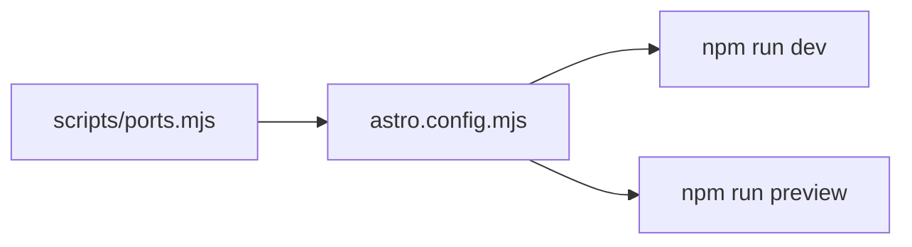

# Troubleshooting

Common issues when developing, building, or deploying the portfolio site.

## Build failures

### Invalid content in `*.json`

**Symptom:**

```text
Invalid content in profile.json:
  • contact.1.href: Invalid url
```

**Cause:** JSON does not match the Zod schema in `src/schemas/`.

**Fix:**

1. Read the field path in the error message.
2. Compare against the schema in `src/schemas/`.
3. Common mistakes: missing required field, invalid URL format, wrong `tier` enum value.

See [Content editing](./content-editing.md).

### Sitemap build crash

**Symptom:**

```text
Cannot read properties of undefined (reading 'reduce')
```

at `astro:build:done` from `@astrojs/sitemap`.

**Cause:** `@astrojs/sitemap` was upgraded to ≥ 3.6.1. Those versions require Astro 5's
`astro:routes:resolved` hook, which does not exist in Astro 4.

**Fix:**

```bash
# Restore the pin in package.json
"@astrojs/sitemap": "3.6.0"

npm ci
npm run build
```

Do **not** run `npm update @astrojs/sitemap`. Either keep the pin or migrate the entire site
to Astro 5.

### Module not found for content JSON

**Symptom:** Cannot resolve `@content/foo.json`

**Cause:** Missing file or wrong import path; `tsconfig.json` path aliases misconfigured.

**Fix:** Ensure the file exists in `content/` and is imported in `src/lib/content.ts` with a
matching schema.

## Local servers and ports

Canonical prose home for the dev/preview server workflow. Port **values** SSOT:
[`scripts/ports.mjs`](../scripts/ports.mjs) - imported by
[`astro.config.mjs`](../astro.config.mjs) with `strictPort: true` (no silent port
drift). Quick-reference port map: [AGENTS.md](../AGENTS.md#local-servers-and-ports).

### Port map

| Mode                    | Port | URL                    | npm script        |
| ----------------------- | ---- | ---------------------- | ----------------- |
| Dev (HMR)               | 4321 | http://localhost:4321/ | `npm run dev`     |
| Preview (built `dist/`) | 4331 | http://localhost:4331/ | `npm run preview` |

Dev and preview can run at the same time (different ports). Legacy port **4322** is
cleared on stop but never used for serving.



### Stop/restart semantics

Defined in [`scripts/dev-stop.mjs`](../scripts/dev-stop.mjs):

| Function / script                                 | Scope                                | Use when                                      |
| ------------------------------------------------- | ------------------------------------ | --------------------------------------------- |
| `npm run dev:stop` - `stopAstroServers()`         | All 4300-4399 + both astro processes | Nuclear cleanup; stale/orphan listeners       |
| `npm run dev:restart` - `stopDevServer()`         | 4321 + `astro dev` only              | Restart dev without killing preview           |
| `npm run preview:restart` - `stopPreviewServer()` | 4331 + `astro preview` only          | Rebuild + restart preview without killing dev |

### Startup workflows

- **Dev only:** `npm run dev:restart` (or `dev:stop` then `npm run dev`)
- **Preview only:** `npm run preview:restart` (stop preview - build - preview on 4331)
- **Both concurrently (recommended):**

  ```bash
  npm run serve         # stop orphans + build; then open two terminals:
  npm run dev:restart   # terminal 1 to 4321
  npm run preview       # terminal 2 to 4331 (dist already built)
  ```

  Manual alternative:

  ```bash
  npm run dev:stop    # once, clear orphans
  npm run build       # preview needs dist/
  npm run dev         # background - 4321
  npm run preview     # background - 4331
  ```

  When server state is unknown, run `dev:stop` first. With selective-stop scripts,
  `dev:restart` and `preview:restart` are safe individually and do not kill the
  other server.

### Hard rules (anti-patterns)

- **Never** pass `--port` / `--host` to `astro dev` or `astro preview` - use npm scripts only.
- **Never** run `astro preview --port 4321` - it occupies the dev port and leaves 4331 empty;
  symptoms look like "preview not running."
- **Never** start multiple `npm run dev` or `npm run preview` sessions without stopping first.
- Preview requires a prior `npm run build`; dev does not.

### Verify servers

Agents run these before reporting port status:

```bash
ss -tlnp | grep -E ':(4321|4331)\s'
curl -sf -o /dev/null -w 'dev:%{http_code}\n'  http://127.0.0.1:4321/
curl -sf -o /dev/null -w 'preview:%{http_code}\n' http://127.0.0.1:4331/
```

Expected: both ports LISTEN, both return `200`. Optional deeper dev check:
`npm run smoke:localhost`.

### Remote / Cursor environments

- Servers bind `host: true` on the remote machine; `localhost:PORT` in the **user's browser**
  only works if the port is forwarded.
- Local `.vscode/settings.json` (gitignored) configures `remote.autoForwardPorts` for 4321 and
  4331 - preview started in a background terminal may not auto-forward; manually add **4331**
  in the Cursor **Ports** panel if remote `curl` passes but the browser fails.
- If `curl` on the remote host fails, fix the server first (don't assume a forwarding issue).

## Local development

### Port already in use / localhost:4321 won't load

**Symptoms:**

- Browser shows connection refused or a blank page at http://localhost:4321
- Terminal logs `Port 4321 is already in use` (or `4331` for preview)
- Stale agent sessions left listeners on random 43xx ports (4322, 4326, 4327, ...)

**Cause:** Multiple `astro dev` / `astro preview` processes compete for ports - common
when agents, terminals, and the VS Code "Astro: dev preview" task all start servers
independently, or when ad-hoc `--port` flags drift from the pinned values. Pinned
ports, stop/restart semantics, and the `--port`/`--host` anti-patterns:
[Local servers and ports](#local-servers-and-ports) above.

**Fix:**

```bash
npm run dev:stop      # stop all Astro listeners on 4300-4399
npm run dev:restart   # clean dev server on 4321
```

For a fresh production preview:

```bash
npm run preview:restart   # stop - build - preview on 4331
```

Do **not** run several `npm run dev` or `npm run preview` sessions without stopping
first. If you use the local `.vscode/tasks.json` "Astro: dev preview" task, run it
manually when needed - it is no longer auto-started on folder open.

### Theme flash on load

**Symptom:** Brief wrong-theme flash before page settles.

**Cause:** `ThemeScript.astro` must be the first element in `<head>` (before CSS).

**Fix:** Do not move or defer the inline theme script. It sets `data-theme` before first paint.

### Mobile menu stuck open

**Symptom:** Menu won't close or body scroll locked.

**Fix:** Hard refresh. The menu resets on viewport resize > 900px. Check browser console for
JS errors in `Header.astro`.

## GitHub Pages / deploy

### 403 on git push

**Symptom:** `Permission denied` pushing to `balajiselvaraj1601/...`

**Cause:** GitHub CLI or git credentials authenticated as a different user.

**Fix:**

```bash
gh auth login          # log in as balajiselvaraj1601
git remote -v          # confirm remote URL
git push -u origin main
```

### Workflow runs but site not updated

**Symptom:** Build succeeds on `portfolio_site` but nothing publishes.

**Cause:** Deploy job is gated to the user-site repo only:

```yaml
if: github.repository == 'balajiselvaraj1601/balajiselvaraj1601.github.io'
```

**Fix:** Push to `balajiselvaraj1601.github.io`, not just the staging mirror. See
[Go-live checklist](./go-live-checklist.md).

### Pages deploy stuck in `deployment_queued` or "in progress deployment"

**Symptom:** `actions/deploy-pages` sits in `deployment_queued` for many minutes, then
times out. Later runs fail with:

```text
Deployment request failed ... due to in progress deployment. Please cancel <sha> first
```

**Cause:** A prior Pages deployment was cancelled or wedged; GitHub still holds a lock on
that commit until it is cleared.

**Fix:**

1. Confirm the user-site repo exists and Pages source is **`gh-pages` branch / root** (not
   the GitHub Actions artifact source unless you have migrated back intentionally).
2. Cancel the blocking deployment (use the SHA from the error message):

   ```bash
   gh api -X POST \
     repos/balajiselvaraj1601/balajiselvaraj1601.github.io/pages/deployments/<SHA>/cancel
   ```

3. Delete stale environment deployments if needed:

   ```bash
   gh api repos/balajiselvaraj1601/balajiselvaraj1601.github.io/deployments \
     --jq '.[].id' | xargs -I{} gh api -X DELETE \
     repos/balajiselvaraj1601/balajiselvaraj1601.github.io/deployments/{}
   ```

4. Re-run **Deploy to GitHub Pages** on `balajiselvaraj1601.github.io` (workflow dispatch).

The workflow uses `cancel-in-progress: true` so overlapping pushes do not stack locks.

### Pages shows 404 after deploy

**Checklist:**

| Check                  | Expected                                         |
| ---------------------- | ------------------------------------------------ |
| Pages source           | **Branch `gh-pages` / root** (see deployment.md) |
| Repo name (user site)  | `balajiselvaraj1601.github.io`                   |
| `base` in astro.config | `'/'` for user site                              |
| `.nojekyll` in dist    | Present at root                                  |
| Workflow deploy job    | Completed successfully                           |

### Assets 404 on live site (`/_astro/`, `/assets/`)

**Cause:** Missing `.nojekyll` - GitHub Pages Jekyll ignores folders starting with `_`.

**Fix:** Ensure `public/.nojekyll` exists (empty file). Rebuild and redeploy.

### Wrong URLs in sitemap or canonical tags

**Cause:** `SITE_URL` in `astro.config.mjs` out of sync with actual Pages URL.

**Fix:** Update `SITE_URL` and `public/robots.txt` together. Rebuild and redeploy.

## Content / privacy

### Phone number appeared on site

**Fix:** Remove from JSON under `content/` immediately. Never add `type: "phone"` to contact.
Re-derive from résumé following curation rules in [content/README.md](../content/README.md).

Verify:

```bash
grep -ri phone content/
```

Should return no matches.

## Performance / quality

### Lighthouse score below 95

**Common causes:**

- Large unoptimized OG image or PDF
- Too much client JS (keep additions minimal)
- Missing alt text on images

Run Lighthouse against `npm run preview` output or the live URL. See [Accessibility](./accessibility.md).

### OG preview not updating

**Cause:** Social platforms cache preview images aggressively.

**Fix:** Use LinkedIn Post Inspector or add a cache-busting query param temporarily after
replacing `og-image.png`. Allow 24-48h for cache expiry.

## Getting help

1. Run `npm run build` locally - most issues surface here.
2. Check the GitHub Actions log for the failing step.
3. Consult the relevant doc:
   - Content - [Content editing](./content-editing.md)
   - Deploy - [Deployment](./deployment.md) · [Go-live checklist](./go-live-checklist.md)
   - Architecture - [Architecture](./architecture.md)
